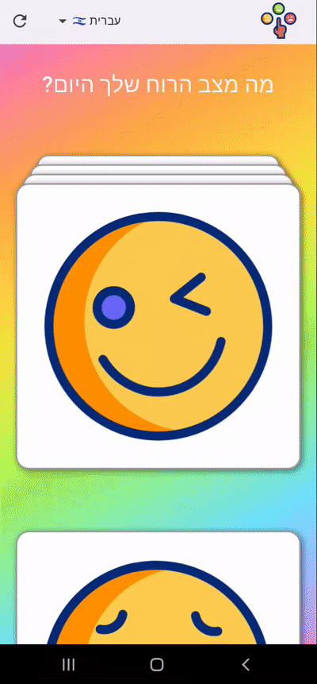

# 😄 Mood Advice App

A simple and beautiful Flutter app that gives advice based on your mood. The app features smooth gradient animations, swipeable mood cards, and support for multiple languages.

## 📸 Demo 

GIFs may take a few seconds to load. If they don't appear immediately - refresh the page.

---

  
  
  <br>
  
---

 
  
  
<br>

---

   
  
---

## ⚙️ Features

- Choose a mood from cards (happy, sad, angry, cool, tired)  
- Get a random piece of advice matching the selected mood  
- Switch between different languages  
- Smooth background gradient transition when selecting a mood  
- "Reset" button to start over

## 🌐 Localization Setup

  <details>
 
  <summary>Click to expand installation instructions</summary>
  &nbsp;
  
1. Add dependencies in pubspec:

```yaml
    dependencies:
      flutter:
        sdk: flutter
      flutter_localizations:
        sdk: flutter
      intl: ^0.20.2
   ```

2. Enable code generation for localisation in pubspec.yaml:
    
```yaml
   flutter:
    generate: true
```

3. Create l10n.yaml in the root directory:

```yaml
 arb-dir: lib/l10n,
 template-arb-file: app_en.arb,
 output-localization-file:
 app_localizations.dart
```

3. Add ARB language files in lib/l10n/
   (example: app_en.arb, app_he.arb) with
   key-value pairs:

```json
   {
     "askMood": "How are you feeling today?",
     "adviceHappy1": "Smile more often!"
}
```
6. Generate localization classes:
  ```bash
   flutter gen-l10n
```
9. Set up MaterialApp to use localization:

```dart
 MaterialApp(
   localizationsDelegates:
 AppLocalizations.localizationsDelegates,
   supportedLocales:
 AppLocalizations.supportedLocales,
   home: const MoodScreen();
```

6. Use localized strings in widgets:

```dart
    final loc = AppLocalizations.of(context)!;
    Text(loc.askMood)
```
</details>

## 📦 Technologies Used

- Provider — state management  
- stacked_card_carousel — mood cards implementation  
- AnimatedContainer / AnimatedSwitcher — animations and smooth transitions  
- AppLocalizations — multilingual support

## 🛠️ Installation & Running

```bash

git clone https://github.com/Ks577/mood-selection-flutter-app.git
cd mood-selection-flutter-app
flutter pub get
flutter run
```
## ✍️ Credits  

All emoji icons are credited in [CREDITS.md](CREDITS.md)
